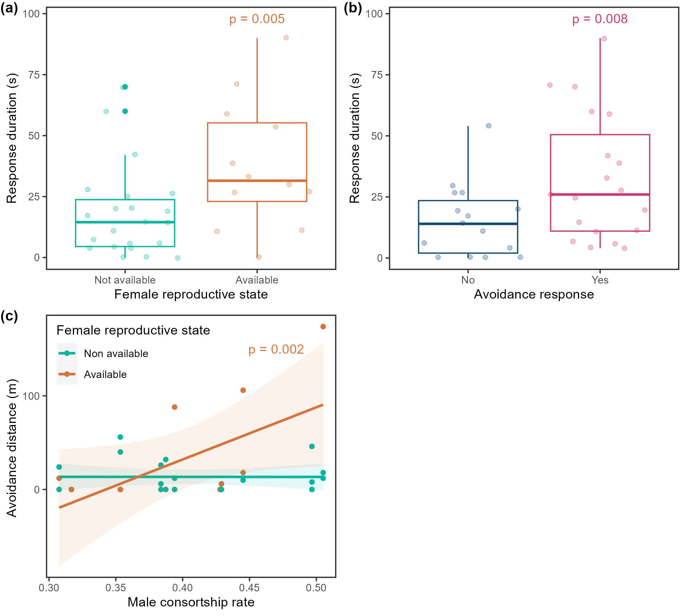
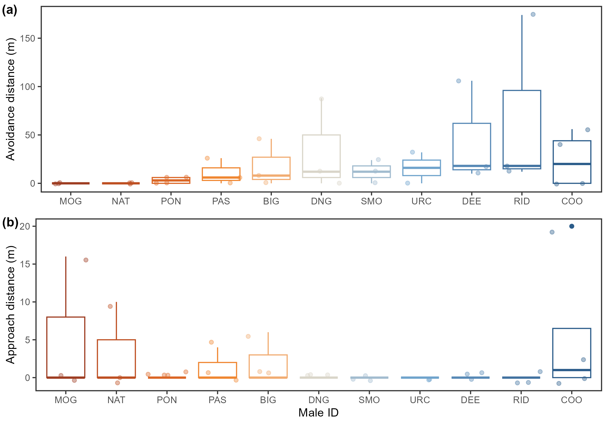

# Playback Experiment: Summary of Results

## 1. Model Results

**Table 1. Model results for female behavioural responses to male playback experiments.**

| Response variable       | Predictor                                              | Estimate | SE   | Confidence interval | *p* value |
|------------------------|--------------------------------------------------------|----------|------|---------------------|-----------|
| (a) Response duration  | Avoidance response (yes / no)                          | 0.82     | 0.29 | 0.26 to 1.38        | **0.008** |
|                        | Female reproductive state (available / not)           | 0.91     | 0.30 | 0.33 to 1.50        | **0.005** |
| (b) Avoidance distance | Male sociability                                       | -0.13    | 0.20 | -0.72 to -0.01      | 0.521     |
|                        | Male consortship rate                                  | 0.05     | 0.21 | -0.38 to 0.47       | 0.831     |
|                        | Female reproductive state (available / not)           | 0.63     | 0.29 | 0.03 to 1.23        | **0.040** |
|                        | Female reproductive state × Male consortship rate     | 1.02     | 0.31 | 0.39 to 1.66        | **0.002** |
| (c) Approach distance  | Female reproductive state (available / not)           | 0.44     | 0.81 | -0.67 to 3.17       | 0.600     |
| (d) Orientation to source | Female reproductive state (available / not)        | 1.47     | 1.32 | -1.21 to 4.16       | 0.283     |
|                        | Male sociability                                       | -0.70    | 0.61 | -1.95 to 0.55       | 0.272     |

**Notes:**  
Parameter estimates were averaged over the top model set based on AIC selection (∆AIC ≤ 2).  
Female ID (subject) and Male ID (playback stimulus) were included as random effects.  
*p* values in **bold** indicate significant results (*p* < 0.05).  
Fixed effects included in the full models: dyadic consortship rate + female sociability + male sociability + male cumulative bond strength + long-term familiarity + dyadic social bond strength + home range overlap + female reproductive state × male consortship rate.  
For the response duration model (a) and the orientation to source model (d), the variable avoidance response (yes / no) was also included as a fixed effect.

## 2. Graphical Summary

### Figure 1. Female behavioural responses to male signature whistle playbacks.

Boxplots of the duration of female response to playbacks depending on (a) female reproductive state and (b) whether the female displayed an avoidance response to the playback or not, with actual values (coloured dots). The middle lines indicate medians, the boxes represent the quartiles, and the vertical lines show the 1.5× interquartile range. (c) Distance moved away from the playback source as a function of male consortship rate and female’s reproductive state.   The lines represent the linear regression fits, with the shaded areas indicating the 95% confidence intervals. In (a) and (c), the two colours indicate the reproductive state of the female, whereas in (b) the colours correspond to whether the female displayed an avoidance response to the playback or not.

### Figure 2. Avoidance vs. approach behaviours of females in response to male ID.

Boxplots of the distance moved (a) away and (b) towards the playback source depending on the identity of the male whose signature whistle was used for the playback, with actual values (coloured dots). The middle lines indicate medians, the boxes represent the quartiles, and the vertical lines show the 1.5× interquartile range. The different colours represent the identity of the different males. 
